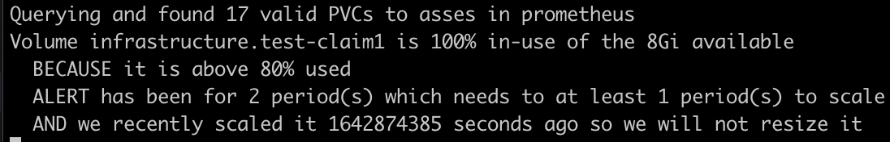

# Kubernetes Volume / Disk Autoscaler (via Prometheus)

<a href="https://hub.docker.com/r/devopsnirvana/kubernetes-volume-autoscaler"></a> <a href="https://github.com/DevOps-Nirvana/Kubernetes-Volume-Autoscaler/releases/tag/1.0.4"></a> <a href="https://github.com/DevOps-Nirvana/Kubernetes-Volume-Autoscaler/stargazers"></a>

This repository contains a [Kubernetes controller](https://kubernetes.io/docs/concepts/architecture/controller/) that automatically increases the size of a Persistent Volume Claim in Kubernetes when it is nearing full.  Initially engineered based on AWS EKS, this should support any Kubernetes cluster or cloud provider which supports dynamically hot-resizing storage volumes in Kubernetes.

Keeping your volumes at a minimal size can help reduce cost, but having to manually scale them up can be painful and a waste of time for an DevOps / Systems Administrator.  This is often used on storage volumes against things in Kubernetes such as [Prometheus](https://prometheus.io), [MySQL](https://artifacthub.io/packages/helm/bitnami/mysql), [Redis](https://artifacthub.io/packages/helm/bitnami/redis), [RabbitMQ](https://bitnami.com/stack/rabbitmq/helm), or any other stateful service.


## Requirements

- [Kubernetes 1.17+ Cluster](https://kubernetes.io/releases/)
- [kubectl binary](https://kubernetes.io/docs/tasks/tools/#kubectl) installed and setup with your cluster
- [The helm 3.0+ binary](https://github.com/helm/helm/releases)
- [Prometheus](https://prometheus.io) installed on your cluster [Example 1](https://artifacthub.io/packages/helm/prometheus-community/prometheus) / [Example 2 (old)](https://github.com/helm/charts/tree/master/stable/prometheus)
- Using an Storage Class with `allowVolumeExpansion == true`
- Using an Volume provisioner which supports dynamic volume expansion
  - EKS default driver on 1.17+ does
  - [AWS EBS CSI driver](https://github.com/kubernetes-sigs/aws-ebs-csi-driver) also does


## Prerequisites

As mentioned above, you must have a storageclass which supports volume expansion, and the provisioner you're using must also support volume expansion.  Ideally, "hot"-volume expansion so your services never have to restart.  AWS EKS built-in provisioner `kubernetes.io/aws-ebs` supports this, and so does the `efs.csi.aws.com` CSI driver.  To check/enable this...

```bash
# First, check if your storage class supports volume expansion...
$ kubectl get storageclasses
NAME      PROVISIONER  RECLAIMPOLICY  VOLUMEBINDINGMODE  ALLOWVOLUMEEXPANSION  AGE
standard  aws-ebs      Delete         Immediate          false                 10d

# If ALLOWVOLUMEEXPANSION is not set to true, patch it to enable this
kubectl patch storageclass standard -p '{"allowVolumeExpansion": true}'
```

**NOTE:** The above storageclass comes with EKS, however, it only supports gp2, which is largely a deprecated and much slower storage driver than [gp3](https://aws.amazon.com/about-aws/whats-new/2020/12/introducing-new-amazon-ebs-general-purpose-volumes-gp3/).  I HIHGLY recommend before using EKS you install the [AWS EBS CSI driver](https://docs.aws.amazon.com/eks/latest/userguide/ebs-csi.html) to gain [gp3](https://aws.amazon.com/about-aws/whats-new/2020/12/introducing-new-amazon-ebs-general-purpose-volumes-gp3/) support and more future-proof support of Amazon's various storage volumes and their lifecycles.

If you do this, you can/should completely remove GP2 support, and after installing the above CSI driver, create a storageclass with the new driver with best-practices in it by default including...

- Retain-ing the volume if it was deleted (to prevent accidental data loss)
- Having all disks encrypted-at-rest by default, for compliance/security
- Using gp3 by default for faster disk bandwidth and IO

```bash
# For this, simply delete your old default StorageClass
kubectl delete storageclass standard
# Then apply/create a new default gp3 using the AWS EBS CSI driver you installed
kubectl apply -f https://raw.githubusercontent.com/DevOps-Nirvana/Kubernetes-Volume-Autoscaler/master/examples/gp3-default-encrypt-retain-allowExpansion-storageclass.yaml
```

## Installation with Helm

Now that your cluster has a `StorageClass` which supports expansion, you can install the Volume Autoscaler

```bash
# First, setup this repo for your helm
helm repo add devops-nirvana https://devops-nirvana.s3.amazonaws.com/helm-charts/

# Example Pre-Install - DRY RUN + VERBOSE, Using auto-discovery, must be in the same namespace as Prometheus
#   Do this if you want to see what this script "would" do.  To view it, view the logs of this service after you deploy it
helm upgrade --install volume-autoscaler devops-nirvana/volume-autoscaler \
  --namespace REPLACEME_WITH_PROMETHEUS_NAMESPACE \
  --set "dry_run=true" \
  --set "verbose=true"

# Example Install 1 - Using auto-discovery, must be in the same namespace as Prometheus
helm upgrade --install volume-autoscaler devops-nirvana/volume-autoscaler \
  --namespace REPLACEME_WITH_PROMETHEUS_NAMESPACE

# Example 2 - Manually setting where Prometheus is
helm upgrade --install volume-autoscaler devops-nirvana/volume-autoscaler \
  --namespace ANYWHERE_DOESNT_MATTER \
  --set "prometheus_url=http://prometheus-server.namespace.svc.cluster.local"

# Example 3 - Recommended final usage, auto-discovery and use slack notifications.  NOTE: Check helm-chart/values.yml for other variables you can override globally
helm upgrade --install volume-autoscaler devops-nirvana/volume-autoscaler \
  --namespace REPLACEME_WITH_PROMETHEUS_NAMESPACE \
  --set "slack_webhook_url=https://hooks.slack.com/services/123123123/4564564564/789789789789789789" \
  --set "slack_channel=my-slack-channel-name"
```

There are also various other variables you're able to set as easily as above.  Please see: [values.yaml](https://github.com/DevOps-Nirvana/Kubernetes-Volume-Autoscaler/blob/master/helm-chart/values.yaml#L9) for all the simple values to adjust this service.  In addition, review the rest of that file if you'd like to adjust other things (like resource limits, node selectors, taints/tolerances, adding labels, etc).

### Advanced helm usage...
```bash
# To update your local knowledge of remote repos, you may need to do this before upgrading...
helm repo update

# To view what changes it will make, if you change things, this requires the helm diff plugin - https://github.com/databus23/helm-diff
helm diff upgrade volume-autoscaler --allow-unreleased devops-nirvana/volume-autoscaler \
  --namespace infrastructure \
  --set "slack_webhook_url=https://hooks.slack.com/services/123123123/4564564564/789789789789789789" \
  --set "slack_channel=my-slack-channel-name" \
  --set "prometheus_url=http://prometheus-server.infrastructure.svc.cluster.local"

# To remove the service, simply run...
helm uninstall volume-autoscaler
```


## (Alternate) Installation with `kubectl`

```bash
# This simple installation will work as long as you put this in the same namespace as Prometheus
# The default namespace of this yaml is hardcoded to is `infrastructure`.  If you'd like to change
# the namespace you can run the first few commands below...

# IF YOU USE `infrastructure` AS THE NAMESPACE FOR PROMETHEUS SIMPLY...
kubectl --namespace infrastructure apply https://devops-nirvana.s3.amazonaws.com/volume-autoscaler/volume-autoscaler-1.0.4.yaml

# OR, IF YOU NEED TO CHANGE THE NAMESPACE...
# #1: Download the yaml...
wget https://devops-nirvana.s3.amazonaws.com/volume-autoscaler/volume-autoscaler-1.0.4.yaml
# #1: Or download with curl
curl https://devops-nirvana.s3.amazonaws.com/volume-autoscaler/volume-autoscaler-1.0.4.yaml -o volume-autoscaler-1.0.4.yaml
# #2: Then replace the namespace in this, replacing
cat volume-autoscaler-1.0.4.yaml | sed 's/"infrastructure"/"PROMETHEUS_NAMESPACE_HERE"/g' > ./to_be_applied.yaml
# #3: If you wish to have slack notifications, edit this to_be_applied.yaml and embed your webhook on the value: line for SLACK_WEBHOOK and set the SLACK_CHANNEL as well accordingly
# #4: Finally, apply it...
kubectl --namespace REPLACEME_WITH_PROMETHEUS_NAMESPACE apply ./to_be_applied.yaml
```

## Validation

To confirm the volume autoscaler is working properly this repo has an example which you can apply to your Kubernetes cluster which is an PVC and a pod which uses that PVC and fills the disk up constantly.  To do this...

```bash
# Simply run this on your terminal
kubectl apply -f https://raw.githubusercontent.com/DevOps-Nirvana/Kubernetes-Volume-Autoscaler/master/examples/simple-pod-with-pvc.yaml
# Then if you'd like to follow-along, "follow" the logs of your volume autoscaler pod to watch it detect full disk and scale up.
kubectl get pods | grep -i volume-autoscaler
kubectl logs --since=10m --follow volume-autoscaler-pod-goes-here-from-the-above-command-output
```

## Usage Information and Nuances

#### 1. Volume MUST be in use (pod is running with volume mounted)

For this software to even work, it has to know how much disk is in-use.  Most/any cloud providers do not "know" this information, which is why on the Cloud Providers' portal you can typically not see "how much percent of the disk is in use" unless you run a special service in your node to send this to your provider [like this one for AWS](https://github.com/DevOps-Nirvana/aws-missing-tools/tree/master/aws-push-cloudwatch-instance-metrics).  So, unless you're actively using the disk, Prometheus doesn't know how full a disk is if you aren't running a pod which has mounted this volume, and if Prometheus doesn't know then we don't know either.

#### 2. Must have waited long enough since the last resize

Additionally, since cloud providers don't let you just constantly resize disks, you will have to wait the amount of time required between resizes.  On AWS this is 6 hours, and once this service has done this once, it will show the following warning in the logs.




## Per-Volume Configuration via Annotations

This controller also supports tweaking your volume-autoscaler configuration per-PVC with annotations.  The annotations supported are...

```yaml
apiVersion: v1
kind: PersistentVolumeClaim
metadata:
  name: sample-volume-claim
  annotations:
    # This is when we want to scale up after the disk is this percentage (out of 100) full
    volume.autoscaler.kubernetes.io/scale-above-percent: "80"   # 80 is the default value
    # This is how many intervals must go by above the scale-above-percent before triggering an autoscale action
    volume.autoscaler.kubernetes.io/scale-after-intervals: "5"  # 5 is this default value
    # This is how much to scale a disk up by, in percentage of the current size.
    #   Eg: If this is set to "10" and the disk is 100GB, it will scale to 110GB
    #   At larger disk sizes you may want to set this on your PVCs to like "5" or "10"
    volume.autoscaler.kubernetes.io/scale-up-percent: "20"      # 20 (percent) is the default value
    # This is the smallest increment to scale up by.  This helps when the disks are very small, and helps hit the minimum increment value per-provider (this is 1GB on AWS)
    volume.autoscaler.kubernetes.io/scale-up-min-increment: "1000000000"  # 1GB by default (in bytes)
    # This is the maximum increment to scale up by.  This helps when the disks are very LARGE, to prevent them from growing too much at a time.
    #   This can be used instead of or in addition to scale-up-percent
    volume.autoscaler.kubernetes.io/scale-up-max-increment: ""  # Unset by default(in "bytes")
    # This is the largest disk size ever allowed for this tool to scale up to.  This is set to 16TB by default, because that's the limit of AWS EBS
    volume.autoscaler.kubernetes.io/scale-up-max-size: "16000000000000"  # 16TB by default (in bytes)
    # How long (in seconds) we must wait before scaling this volume again.  For AWS EBS, this is 6 hours which is 21600 seconds but for good measure we add an extra 10 minutes to this, so 22200
    volume.autoscaler.kubernetes.io/scale-cooldown-time: "22200"  
    # If you want the autoscaler to completely ignore/skip this PVC, set this to "true"
    volume.autoscaler.kubernetes.io/ignore: "false"  
    # Finally, Do not set this, and if you see this ignore this, this is how Volume Autoscaler keeps its "state"
    volume.autoscaler.kubernetes.io/last-resized-at: "123123123"  # This will be an Unix epoch timestamp
spec:
  accessModes:
  - ReadWriteOnce
  resources:
    requests:
      storage: 1Gi
  storageClassName: standard
```


## Prometheus Metrics Supported

This controller also supports publishing prometheus metrics automatically.  It hosts a simple http server on port 8000 and publishes the following metrics

```
# HELP volume_autoscaler_resize_evaluated_total Counter which is increased every time we evaluate resizing PVCs
# TYPE volume_autoscaler_resize_evaluated_total counter
volume_autoscaler_resize_evaluated_total 1.0
# HELP volume_autoscaler_resize_evaluated_created Counter which is increased every time we evaluate resizing PVCs
# TYPE volume_autoscaler_resize_evaluated_created gauge
volume_autoscaler_resize_evaluated_created 1.666564445372884e+09
# HELP volume_autoscaler_resize_attempted_total Counter which is increased every time we attempt to resize
# TYPE volume_autoscaler_resize_attempted_total counter
volume_autoscaler_resize_attempted_total 0.0
# HELP volume_autoscaler_resize_attempted_created Counter which is increased every time we attempt to resize
# TYPE volume_autoscaler_resize_attempted_created gauge
volume_autoscaler_resize_attempted_created 1.666564445372895e+09
# HELP volume_autoscaler_resize_successful_total Counter which is increased every time we successfully resize
# TYPE volume_autoscaler_resize_successful_total counter
volume_autoscaler_resize_successful_total 0.0
# HELP volume_autoscaler_resize_successful_created Counter which is increased every time we successfully resize
# TYPE volume_autoscaler_resize_successful_created gauge
volume_autoscaler_resize_successful_created 1.6665644453729012e+09
# HELP volume_autoscaler_resize_failure_total Counter which is increased every time we fail to resize
# TYPE volume_autoscaler_resize_failure_total counter
volume_autoscaler_resize_failure_total 0.0
# HELP volume_autoscaler_resize_failure_created Counter which is increased every time we fail to resize
# TYPE volume_autoscaler_resize_failure_created gauge
volume_autoscaler_resize_failure_created 1.666564445372905e+09
# HELP volume_autoscaler_num_valid_pvcs Gauge with the number of valid PVCs detected which we found to consider for scaling
# TYPE volume_autoscaler_num_valid_pvcs gauge
volume_autoscaler_num_valid_pvcs 3.0
# HELP volume_autoscaler_num_pvcs_above_threshold Gauge with the number of PVCs detected above the desired percentage threshold
# TYPE volume_autoscaler_num_pvcs_above_threshold gauge
volume_autoscaler_num_pvcs_above_threshold 0.0
# HELP volume_autoscaler_num_pvcs_below_threshold Gauge with the number of PVCs detected below the desired percentage threshold
# TYPE volume_autoscaler_num_pvcs_below_threshold gauge
volume_autoscaler_num_pvcs_below_threshold 3.0
# HELP volume_autoscaler_release_info Release/version information about this volume autoscaler service
# TYPE volume_autoscaler_release_info gauge
volume_autoscaler_release_info{version="1.0.4"} 1.0
# HELP volume_autoscaler_settings_info Settings currently used in this service
# TYPE volume_autoscaler_settings_info gauge
volume_autoscaler_settings_info{dry_run="false",http_timeout_seconds="15",interval_time_seconds="60",prometheus_label_match="",prometheus_url="http://prometheus-server",prometheus_version_detected="Unknown",scale_above_percent="80",scale_after_intervals="5",scale_cooldown_time_seconds="22200",scale_up_maximum_increment_bytes="16000000000000",scale_up_maximum_size_bytes="16000000000000",scale_up_minimum_increment_bytes="1000000000",scale_up_percent="20",verbose_enabled="false"} 1.0
```


# Release History

### [Release: 1.0.4 - Oct 24, 2022](https://github.com/DevOps-Nirvana/Kubernetes-Volume-Autoscaler/releases/tag/1.0.4)
```
Generate informational Prometheus metrics (version number and settings)
Generate usage & health Prometheus metrics (number of pvcs, number of resizes, etc)
Updating upstream universal helm chart
Scaled down default resize percentage to 20% (down from 50%) based on feedback
Updated to Python 3.9.15 (thanks @pblgomez)
```

### [Release: 1.0.3 - Jan 24, 2022](https://github.com/DevOps-Nirvana/Kubernetes-Volume-Autoscaler/releases/tag/1.0.3)
```
Handle signal from Kubernetes to kill/restart properly/quickly
Add full env vars as documentation markdown table, inside notes for development section below
Adding better exception logs via traceback, and more readable/reasonable log output especially when VERBOSE is enabled
Generate Kubernetes events so everyone viewing the event stream knows when actions occur.  AKA, Be an responsible controller
```

### [Release: 1.0.2 - Jan 15, 2022](https://github.com/DevOps-Nirvana/Kubernetes-Volume-Autoscaler/releases/tag/1.0.2)
```
Automatically detecting version of Prometheus and using newer functions to de-bounce invalid PVCs automatically
Adding max-increment annotation/variable support
Adding exception handling in our main loop to handle jitter nicely and not fail catastrophically if someone has bad PVC annotations
Making all variables settable by a value in the helm chart
Adding verbose support, which when enabled prints out full data from the objects detected, and prints out even non-alerting disks
Printing the number of PVCs found in the log, useful when not in verbose mode
```

### [Release: 1.0.1 - Jan 4, 2022](https://github.com/DevOps-Nirvana/Kubernetes-Volume-Autoscaler/releases/tag/1.0.1)
```
Initial Public Release
Basic PVC Annotation support
Publishing a Helm Chart
A few variables configurable in the Helm Chart values
Some basic documentation and installation help/guides
```

# TODO

Current Release: 1.0.4

This todo list is mostly for the Author(s), but any contributions are also welcome.  Please [submit an Issue](https://github.com/DevOps-Nirvana/Kubernetes-Volume-Autoscaler/issues) for issues/requests, or an [Pull Request](https://github.com/DevOps-Nirvana/Kubernetes-Volume-Autoscaler/pulls) if you added some code.  These items are generally put in order of most-important first.

* Listen/watch to events of the PV/PVC, or listen/read from Prometheus to monitor and ensure the resizing happens, log and/or slack it accordingly
* Catch WHY resizing failed (try?) and make sure to log/send to slack/k8s events the why
* Check if storage class has the ALLOWVOLUMEEXPANSION to (help?) ensure the expansion will succeed, do something about it and/or report it
* Add full helm chart values documentation markdown table (tie into adding docs for Universal Helm Charts)
* Push to helm repo in a Github Action and push the static yaml as well, make things "easier" and automated
* Add badges to the README regarding Github Actions success/failures
* Add tests coverage to ensure the software works as intended moving forward
* Make per-PVC annotations to (re)direct Slack to different webhooks and/or different channel(s)?
* Discuss what the ideal "default" amount of time before scaling.  Currently is 5 minutes (5, 60 minute intervals)
* Add better examples for "best practices" when using Helm (aka, subchart)
* Test it and add working examples of using this on other cloud providers (Azure / Google Cloud)
* Auto-detect (or let user choose) a different provider (eg: AWS/Google) and set different per-provider defaults (eg: wait time, min/max disk size, min disk increment, etc)
* Prevent flooding to slack if many items (per-loop) need to be scaled.  Group them into one big message!
* Make it possible to autoscale up node's root volumes?  This will require significant engineering, as this would require talking to the provider APIs, and require an IAM/OIDC/AccessKey/etc to be able to scale the root volume up.  Likely very challenging, but would be ideal to handle.  Consider writing a new service dedicated for this instead.
* Add filter to allow users to specify only which StorageClasses to support, default of "all" or "*"

# Alternative services

Here is another similar service to this.  Its written in Golang, but it lacks some of the configurability that this tool has currently.  Check it out https://github.com/topolvm/pvc-autoresizer/

# Notes for Development

This tool can easily be run locally, as long as you have an functioning kubectl config, and as long as you can reach the http(s) endpoint for your cluster's prometheus.  If your prometheus is internal-only, you may need to have an VPN setup into your VPC/Cluster.  I recommend OpenVPN if you're installing one in your Kubernetes cluster.  I have an [example of installing OpenVPN into Kubernetes here](#todo).

```bash
# To test out/develop new features, first get your prometheus IP address...
kubectl get services --all-namespaces | grep -i prometheus-server
infrastructure  prometheus-server  ClusterIP  10.100.57.102  <none>  80/TCP  109d
# Then take its IP address and check if you can use it...
curl http://10.100.57.102
<a href="/graph">Found</a>
# Alternatively, if your ops/devops person setup an ingress to make this accessible externally...
curl https://prometheus.mycompany.com
# Alternatively, if you wish to port forward to your cluster...
kubectl port-forward svc/prometheus-server 8001:80 &
# and check if it works...
curl http://localhost:8001
# Once you have established a functioning URL to prometheus, put it in the following command
# and you'll be off and running in a safe way that won't affect anything because of DryRun
VERBOSE=true DRY_RUN=true PROMETHEUS_URL=http://PUT_PROMETHEUS_URL_FROM_ABOVE_HERE ./main.py
# Of course, remove DRY_RUN above if you want to actually have the software try to scale your disks by patching the PVC desired storage resources
```

The follow environment variables are settable during development to alter the default logic.  These are also settable via the Helm Chart in values, and overridable [per-PVC in Annotations](#per-volume-configuration-via-annotations)

| Variable Name          | Default        | Description |
|------------------------|----------------|-------------|
| INTERVAL_TIME          | 60             | How often (in seconds) to scan Prometheus for checking if we need to resize |
| SCALE_ABOVE_PERCENT    | 80             | What percent out of 100 the volume must be consuming before considering to scale it |
| SCALE_AFTER_INTERVALS  | 5              | How many intervals of INTERVAL_TIME a volume must be above SCALE_ABOVE_PERCENT before we scale |
| SCALE_UP_PERCENT       | 20             | How much percent of the current volume size to scale up by.  (100 == (if disk is 10GB, scale to 20GB), eg: 20 == (if disk is 10GB, scale to 12GB) |
| SCALE_UP_MIN_INCREMENT | 1000000000     | How many bytes is the minimum that we can resize up by, default is 1GB (in bytes, so 1000000000) |
| SCALE_UP_MAX_INCREMENT | 16000000000000 | How many bytes is the maximum that we can resize up by, default is 16TB (in bytes, so 16000000000000) |
| SCALE_UP_MAX_SIZE      | 16000000000000 | How many bytes is the maximum disk size that we can resize up, default is 16TB for EBS volumes in AWS (in bytes) |
| SCALE_COOLDOWN_TIME    | 22200          | How long (in seconds) we must wait before scaling this volume again.  For AWS EBS, this is 6 hours which is 21600 seconds but for good measure we add an extra 10 minutes to this, so 22200 |
| PROMETHEUS_URL         | `auto-detect`  | Where prometheus is, if not provided it can auto-detect it if it's in the same namespace as this Volume Autoscaler |
| DRY_RUN                | false          | If we want to dry-run this, aka don't do any actions, only report (for dev/testing/poc purposes) |
| PROMETHEUS_LABEL_MATCH |                | A PromQL label query to restrict volumes for this to see and scale, without braces.  eg: 'namespace="dev"' |
| HTTP_TIMEOUT           | 15             | Allows to set the timeout for calls to Prometheus and Kubernetes.  Adjust this if your Prometheus or Kubernetes is over a remote WAN link with high latency and/or is heavily loaded |
| VERBOSE                | false          | If we want to verbose mode, prints out the raw data from each PVC and its status/state instead of the default "" |
